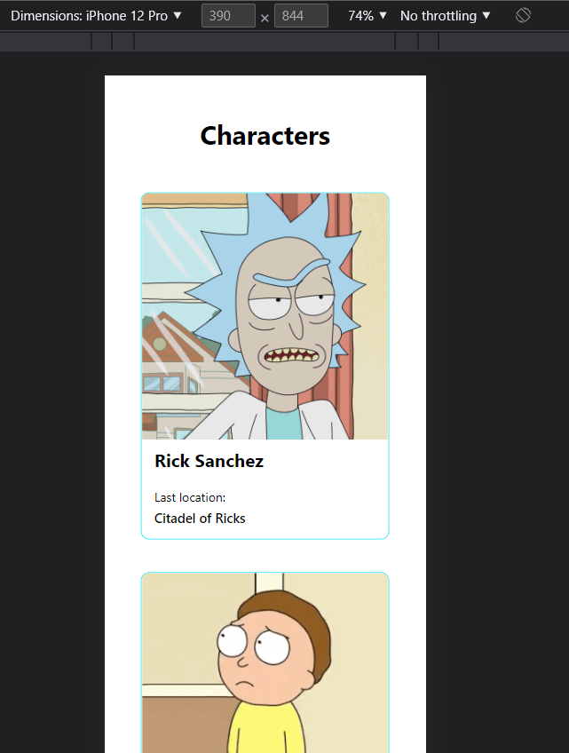

# Make It Real - Profile Card Component

This is a solution to the first React project of the Make It Real course.

## Table of contents

- [Overview](#overview)
  - [The challenge](#the-challenge)
  - [Solution Screenshot](#solution-screenshot)
- [My process](#my-process)
  - [Built with](#built-with)
  - [What I learned](#what-i-learned)
  - [Continued development](#continued-development)
  - [Useful resources](#useful-resources)
- [Author](#author)
- [Acknowledgments](#acknowledgments)

## Overview

### The challenge

Users should be able to:

- Design a layout as close as the screenshot picture of the project.

### Solution Screenshot




## My process

### Built with

- React
- Flexbox
- Semantic HTML5
- Axios (http petitions)

### What I learned

We learned how to bluid a React app using <useState()> and <useEffect()> hooks.

```js
const [character, setCharacter] = useState([]);
useEffect(() => {
  axios.get("https://rickandmortyapi.com/api/character").then((response) => {
    setCharacter(response.data.results);
  });
}, []);
```

We learned how to wrap flex components for giving the layout responsive features

```css
.cardWrapper {
  display: flex;
  flex-wrap: wrap;
  justify-content: center;
}
```

We learned how to use http petitions for getting information from API's

```js
const [character, setCharacter] = useState([]);
useEffect(() => {
  axios.get("https://rickandmortyapi.com/api/character").then((response) => {
    setCharacter(response.data.results);
  });
}, []);
```

```js
{
  character.map((item) => {
    return (
      <section className="card">
        <figure className="cardImage">
          
        </figure>
        <article className="cardText">
          <h1 className="cardImageName">{item.name}</h1>
          <p className="cardTextLastLocation">Last location:</p>
          <p className="cardTextLocation">{item.location.name}</p>
        </article>
      </section>
    );
  });
}
```

### Continued development

It will be nice to continue developing the layout in order to show more information about the Rick & Mortie's characters in the front-end.

### Useful resources

- [useState resourse](https://reactjs.org/docs/hooks-state.html) - This helped me figuring out how to use this property.
- [useEffect resourse](https://reactjs.org/docs/hooks-effect.html) - This helped me figuring out how to use this property.
- [Axios resourse](https://guias.makeitreal.camp/javascript-browser/peticiones-http) - This helped me figuring out how to use this property.

## Author

- Github - [Juan Velasco](https://github.com/juandiegovelsol)
- Github - [Jailer Fonseca]()

## Acknowledgments

Kudos to our friends and mentors: Sergio Jaramilo and Daniel Espitia.
